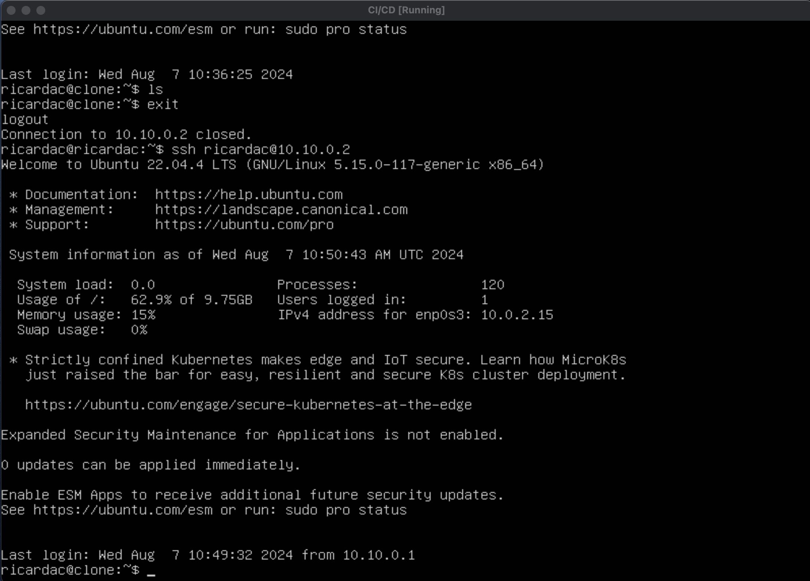
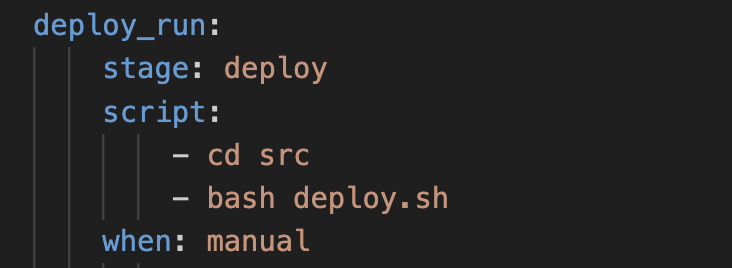
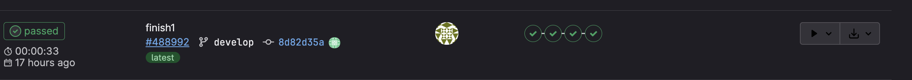

## Part 1. Настройка gitlab-runner  
#### Поднимаем виртуальную машину  

#### Скачиваем и устанавливаем gitlab-runner  

#### Установить и обновить пакеты на машине:

- sudo apt install make
- sudo apt install gcc
- sudo apt-get update
- sudo apt-get upgrade

`curl -L "https://packages.gitlab.com/install/repositories/runner/gitlab-runner/script.deb.sh"|sudo bash`

#### Запустить gitlab-runner и зарегистрировать его для использования в текущем проекте (DO6_CICD). Для регистрации понадобятся URL и токен, которые можно получить на страничке задания на платформе. 

- sudo gitlab-runner start
- sudo gitlab-runner register
 

## Part 2. Сборка

**== Задание ==**

#### Написать этап для **CI** по сборке приложений из проекта *C2_SimpleBashUtils*
#### В файле _gitlab-ci.yml_ добавить этап запуска сборки через мейк файл из проекта C2
#### Файлы, полученные после сборки (артефакты), сохранять в произвольную директорию со сроком хранения 30 дней.
- Скопировал папки cat и grep из проекта simpleBashUtils в папку src проекта CICD: 
 
- создал и описал файл .gitlab-ci.yml
    - Файл .gitlab-ci.yml - это файл конфигурации для настройки и определения задач и пайплайнов непрерывной интеграции и непрерывной доставки (CI/CD) в GitLab. В этом файле вы описываете, какие шаги должны выполняться автоматически при каждом пуше кода в ваш репозиторий. После добавления .gitlab-ci.yml файла в ваш репозиторий, GitLab CI/CD будет автоматически создавать пайплайны и выполнять задачи согласно вашим настройкам. Вы сможете видеть результаты выполнения задач в веб-интерфейсе GitLab, а также настраивать уведомления, автоматическое развертывание и другие аспекты CI/CD процесса.
  

  

### Part 3. Тест кодстайла

**== Задание ==**

#### Написать этап для **CI**, который запускает скрипт кодстайла (*clang-format*):
#### Если кодстайл не прошел, то "зафейлить" пайплайн

- После выполения команды clang-format исходный код изменяется и строка __git diff --exit-code__ как раз и показывает различия между закомиченым вараинтом и измененым. Если различия есть строка возвращает 1.

  

#### В пайплайне отобразить вывод утилиты *clang-format*
  
  
 

## Part 4. Интеграционные тесты

**== Задание ==**
#### Написать этап для **CI**, который запускает ваши интеграционные тесты из того же проекта:
#### Запускать этот этап автоматически только при условии, если сборка и тест кодстайла прошли успешно
#### Если тесты не прошли, то "зафейлить" пайплайн

- Мои тесты возвращают 2 строки:  количество SUCCESS и FAIL тестов. Таким образом для фела пеплайна необходимо чтобы в строке FAIL было значение не 0, то есть хотябы 1 тест был зафейлен. Для этого в скрипте запускаем тесты и смотрим на строку FAIL, если она не равна 0, то роняем пеплайн.

  

#### В пайплайне отобразить вывод, что интеграционные тесты провалились, потому что я поставил тест, который точно будет FAIL
  

#### В пайплайне отобразить вывод, что интеграционные тесты прошли, потому что FAIL: 0
  

## Part 5. Этап деплоя

**== Задание ==**
#### Подними вторую виртуальную машину Ubuntu Server 22.04 LTS*

  

#### Написать этап для **CD**, который "разворачивает" проект на другой виртуальной машине:
#### Запускать этот этап вручную при условии, что все предыдущие этапы прошли успешно

- Изменяем файл /etc/netplan/00-installer-config.yaml на обеих машинах:
  
  
- необходимо перенастроить сетевые адаптеры обеих машин следующим образом:
  
- Пропингуем вторую машину с первой, чтобы убедиться, что соединение есть:
  

#### Заходим на первой машине под пользователя gitlab-runner(sudo su gitlab-runner), создаём ключ (ssh-keygen) и копируем его на вторую машину(ssh-copy-id user@ip (ricardac@10.10.0.2)  )
  

#### Теперь мы можем подключаться ко второй машине через ssh без необходимости ввода пароля:

  

#### Написать bash-скрипт, который при помощи **ssh** и **scp** копирует файлы, полученные после сборки (артефакты), в директорию */usr/local/bin* второй виртуальной машины

- На второй машине дадим права для папки /usr/local/bin/ командой __sudo chmod -R 777 /usr/local/bin__

  

#### В файле _gitlab-ci.yml_ добавить этап запуска написанного скрипта
 
   

#### В случае ошибки "зафейлить" пайплайн
   
В результате вы должны получить готовые к работе приложения из проекта *C2_SimpleBashUtils* (s21_cat и s21_grep) на второй виртуальной машине.
   
#### Сохрани дампы образов виртуальных машин.

   

### Part 6. Дополнительно. Уведомления

**== Задание ==**

#### Настроить уведомления о успешном/неуспешном выполнении пайплайна через бота с именем "[ваш nickname] DO6 CI/CD" в *Telegram*
- первым делом необходимо получить токен бота. Для этого используем инфраструктуру телеграма, а точнее главного бота "BotFather". Выполняем команды и получаем токен.
   
  

- далее необходимо получить __id чата__. Для этого в адресной строке браузера забиваем `https://api.telegram.org/bot<тут_твой_токен>/getUpdates`, 
- уже находясь на указанной странице отправьте любое сообщение в чат бота. На странице отобразятся данные, включая id чата в который вы отправили сообщение (поле chat->id):

  

- далее пишем скрипт который будет контролировать работу каждого этама CI/CD:
- part6.sh
- добавляем выполнение скрипта после каждого этапа, итоговый файл .gitlab-ci.yml выглядит так:
  

- коммитим, пушим и проверяем работу бота
  